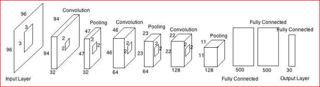

# Facial_Keypoint_Detection

This project was done as a part CS-574 (Computer Vision using Machine Learning) course at IIT Guwahati.

## Dependencies
1. Numpy
2. Python 3.6
3. Keras(with Tensorflow Backend)
4. Pandas
5. Scikit-Learn

## Architectures 
We have tried out 4 types of Architecture namely :
1) RandomForest
   * Data was split into 23% test data and 77% training data.
   * RMSE = 2.72725802
2) Feed-forward Neural Network (with single hidden layer of 100 neuron)
   * Data was split into 23% test data and 77% training data.
   * RMSE = 2.98529003976
   * Some result on test data: 
   * 
3) Convolutional Neural Network 
   * Data was split into 23% test data and 77% training data.
   * RMSE = 2.5521943944
   * Following CNN architecture was used for model-3 and model-4 :
   * 
4) Convolutional Neural Network (with dropout on every layer)
   * Data was split into 23% test data and 77% training data.
   * Dropout probablity of 0.5 was used in model 4.
   * RMSE = 2.32341972693
   * Following is the comparison of model-3 and model-4 :
   * 
   
## Final Results
   Our result showed that CNN(with dropout) performed best on facial keypoint detection task followed by CNN(without dropout),      RandomForest and Simple Feed Forward Network respectively.

## Project Members
1. Abhinav Anshuman
2. Aditya Gaurav
3. Chirag Sodani
4. Rahul Kumar
